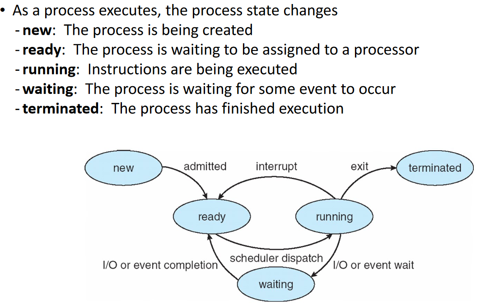
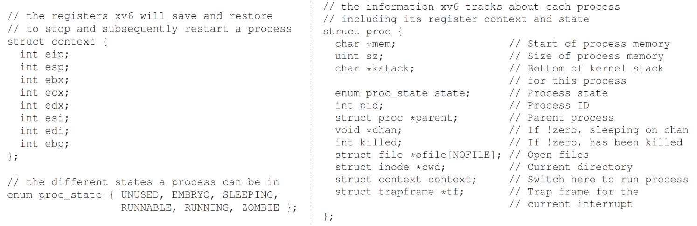

### Introduction
This entry contains the notes of ch04 & ch06 of Operating Systems.

### Process
* What is a process?
    * A running instance of a program
        * The cool part is, as we will learn later, it is not always running.
        * Computers without process, can run only one instance at a time.
* Concurrency vs Parallelism
    * Concurrency
    > Continuous/Simultaneous progress.  
    This is the typical multitasking we "try". Chatting with our friends and ~~trying to~~ studying. ~~닭 한마리 잡아먹고~~ 

    * Parallelism
    > Multiple hardware units present.  
    For example, humans can walk while talking.
* The insides of a process
    * Memory space
        * Address space. This topic will be dealt later..
    * CPU states
        * Mostly, registers.
    * I/O information

### Process Creation
* A process is managed by pid (process identifier).
    * How are the identifiers determined?
    > Random, similar to real-life order tickets.
    * The main points to remember:
        1. A parent process can "spawn" child process.
            * Child processes can share resourcse by duplicating the memory of its parent.
        2. The data of a process is loaded on to memory.
            * In either lazy or eager manner.

### Process Lifecycle
* It is simpler to see the diagram

 
* Why does the zombie process exist?
    * To indicate bugs. Bugs tend to stay in companies, a small error may lead to a bigger one.
    * The kernel wants to show the developer something went wrong with the process.

### Process Data Structure

 

* This shows a real example of the CPU state of the xv6.
* The register values stored in the *context* struct is what is saved. This is called a "CPU-Snapshot".
    * CPU-Snapshots are taken to make context-switching possible.

### Process Mechanisms
* Time-sharing
* Limited Direct Execution
    * Runs directly on CPU with restrictions.
    * This restriction is applied when the mode is set to user.
    * Applications are error-prone, a sole controller is needed to manage the OS.

### User mode & Kernel mode
* User mode
    * For applications program execution.
    * Restriction is applied
* Kernel mode
    * All privileged operations can be executed.
* This achevied by switching the mode bit (special register).
    *  The mode bit is implemented as a flag in the processor's status register or processor mode register.
* Ofcourse this raises the question: What if an application program needs to execute privleged operations?
    * This is where **system call** is introduced.

### System Call
* The goal of allowing a single way for an application program to access the system is for reliability.
    * By blocking accesses via other ways, the kernel only needs to focus on managing system calls.
* To execute a system call, an application must raise a **trap** instruction.
    * Trap
    >  It causes the processor to transfer control to a pre-defined location in the operating system known as the **trap handler**. The trap handler then performs a specific action or service requested by the application program or handles the exceptional condition that caused the trap.
    * The specific action is determined by thge entry corresponding in the **trap table**.
    * Trap table 
    
 
    * "Program termination is not natural"
        * As OS is virtual, a corrupt program doesn't corrupt the entire system.
        * So it's not the application program that gets the privileges, but the kernel getting control over the application program.
            * The application program yields control over.

### Etc.
* Direct Memory Access
> DMA stands for Direct Memory Access. It is a mechanism that allows hardware devices, such as disk drives, network interfaces, and sound cards, to access main memory directly without involving the CPU. This improves system performance by freeing up the CPU to perform other tasks while data is being transferred between the device and memory.
 
The DMA controller is responsible for managing the transfer of data between the device and memory. It communicates with the device to determine the source and destination of the data transfer and controls the transfer of data between the device and memory without CPU intervention.
* Northbridge & Southbridge
> In computer architecture, the northbridge and southbridge are the two chips that make up the chipset on a motherboard. The northbridge chip is responsible for connecting the CPU to high-speed components such as RAM and the graphics card, while the southbridge chip is responsible for connecting the CPU to lower-speed components such as hard drives, USB ports, and audio interfaces.
 
> The northbridge and southbridge communicate with each other over the front-side bus (FSB), which is a high-speed interconnect that connects the CPU to the chipset. The northbridge typically contains the memory controller, which manages access to system memory, and the graphics controller, which handles the display output. The southbridge typically contains the input/output (I/O) controller, which manages communication between the CPU and peripheral devices.
 
> In operating systems, the DMA controller, northbridge, and southbridge are all important components of the system architecture that contribute to the efficient operation of the system. The operating system must be able to manage these components effectively to ensure efficient data transfer between devices and memory, and to provide a seamless user experience.
* ~~임베 안들으면 barbarian~~
* Some example problems one could try answering:
1. Suppose that your system has a special hardware module. To interface application programs with the hardware module, you are asked to add a new system call to the kernel. Explain what you need to add and/or modify to accomplish this task
    * My answer:
        1. Define the system call
        2. Modify the system call table
        3. Implement the system call handler function
        4. Update the kernel documentation
        5. Test the new system call