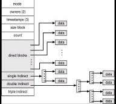

### Introduction

This entry contains the notes of ch40 of Operating Systems.

### Getting Started

Things to remember before starting:

* What types of on-disk structures are utilized by the file system to orgranize its data and metadata?
* How does it map the calls made by a process, onto its structures?

### File Organization

* Data (User)
* Metadata(inode)
* Allocation(bitmap)
* Superblock

### Partitioning

Methods to divide the resource.

* Static partitioning
  * Uses **fixed proportions**.
* Dynamic partitioning
  * Uses **differing amounts**.

### Benefits of buffering

* Batch updates.
* Schedule better
* Delays till removal -> avoiding

### Exercise

1. Twelve direct pointers, as well as both a single and a double indirect block. Assuming a block size of 4 KB, and 4-byte pointers, this structure can accom- modate a file of just over 4 GB in size (i.e., (12 + 1024 + 10242) × 4 KB). Can you figure out how big of a file can be handled with the addition of a triple-indirect block?

Like the picture above, each pointer either points directly to data blocks, or pointers.

A block is 4 KB, pointers are 4 bytes.

* Direct Pointers
  * 12 direct pointers * pointer (4 bytes) = 48 bytes
* Single Indirect Block:
  * The block (4 KB) )contains (4 KB / 4 bytes = 1024) 1024 pointers.
  * Each pointer (1024)) points to a block (4 KB), 4MB.
* Double Indirect Blocks:
  * Similar to the Single Indirect Blocks, has 1024 pointers.
  * Adding on a layer to Single Indirect Blocks, the 1024 pointers each have 1024 pointers that point to a data block (4 KB).
  * Therefore, 1024 * (1024 * 4 KB) = 1024 * 4MB = 4 GB
* Triple Indirect Blocks:
  * At this point you can see the pattern.
  * Simply add a layer of pointers each pointing to the successing layer of indirect/direct blocks.

### Links & References

[Linux Filesystem](https://e2fsprogs.sourceforge.net/ext2intro.html)
